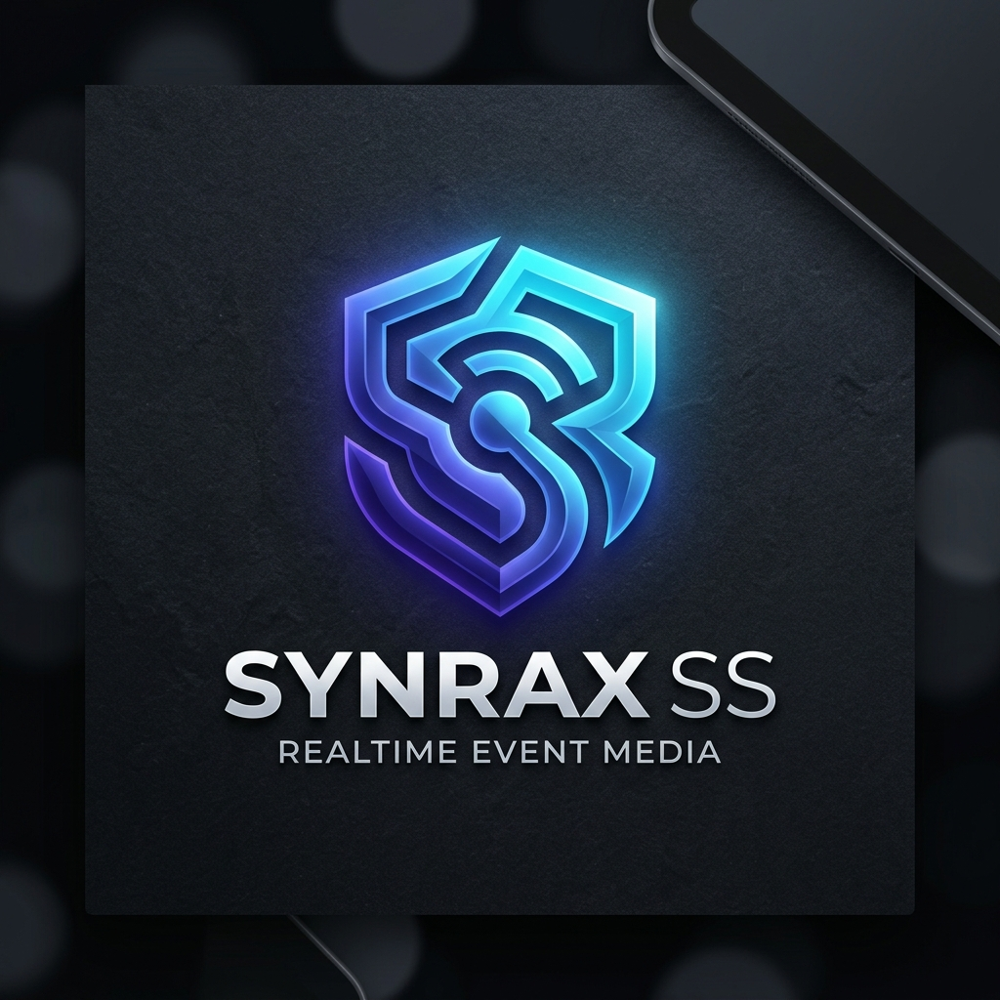
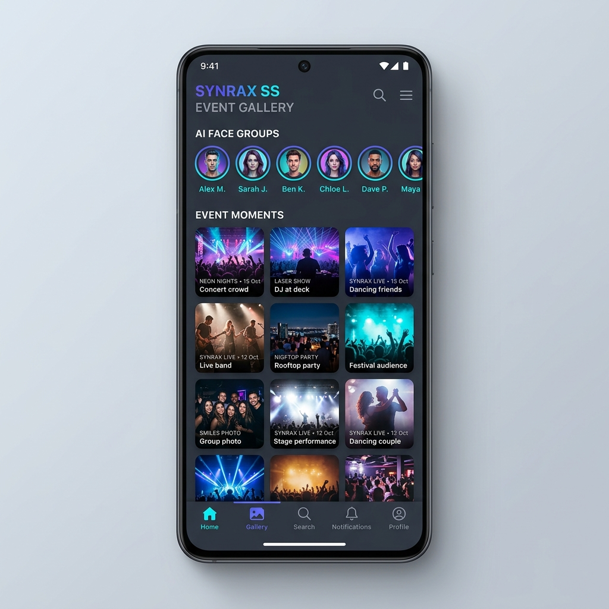
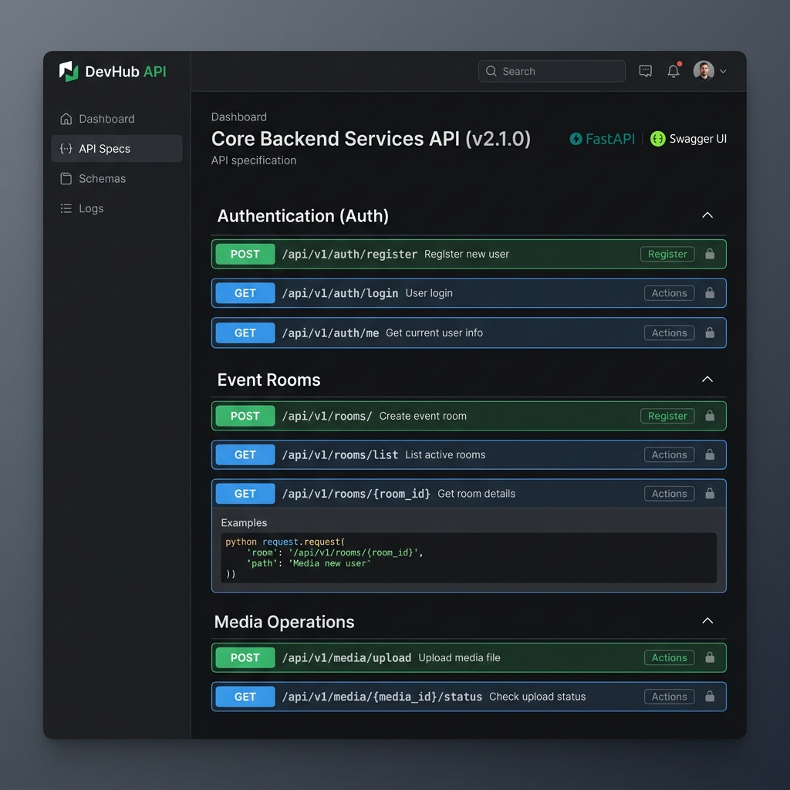

# SYNRAX SS - Realtime AI Event Media Platform

<p align="center">
  
</p>

**SYNRAX SS** is an AI-powered, real-time event media sharing platform. It allows users to spin up temporary event rooms instantly, invite participants using dynamically generated QR codes, upload high-resolution photos or videos, and experience live grid updates on their devices as others upload. 

Integrated AI services run on the backend to automatically detect faces in uploaded media, group photos by matching persons (face clustering), and allow participants to filter the gallery to view only the pictures they are in.

---

## 🏗️ High-Level System Architecture

The project consists of a Python FastAPI backend acting as the central coordination API, and a native Java Android frontend application.

```mermaid
sequenceDiagram
    actor UserA as Participant A (Uploader)
    participant AppA as Android Client (A)
    participant Server as FastAPI Backend API
    participant DB as SQLite / PostgreSQL Database
    participant AppB as Android Client (B)
    actor UserB as Participant B (Viewer)

    UserA->>AppA: Captures photo & taps Share
    AppA->>Server: POST /media/upload (Multipart file + event_id)
    activate Server
    Server->>Server: Extract EXIF metadata & compute image hashes
    Server->>Server: Run AI Face Detection & Feature Extraction
    Server->>Server: Run clustering engine (scikit-learn) to group faces
    Server->>DB: Write Media details and associations
    Server-->>AppA: 201 Created (Media response)
    deactivate AppA
    Server->>AppB: Broadcast via WebSocket (Room WS connection)
    deactivate Server
    AppB-->>UserB: Real-time UI refresh (Appends image to top of grid)
```

---

## 📱 Android Frontend (Client)

<p align="center">
  
</p>

The Android client is structured using a beginner-friendly MVVM/layered architecture layout. It is optimized for low latency and high reliability under unstable network connections.

### Tech Stack & Libraries
* **Language**: Java 11
* **UI Engine**: Android XML Layouts with Material Design Components
* **Networking**: Retrofit 2 & OkHttp 4
* **Image Loading**: Glide (with horizontal progress transitions)
* **QR Scanning**: Google Play Services (ML Kit) Code Scanner (requires no camera layout configurations)
* **QR Generation**: ZXing Core

### Folder Structure
```
android/app/src/main/
├── AndroidManifest.xml          # Declares activities, permissions, & FileProvider
├── java/com/synrax/ss/
│   ├── data/
│   │   ├── SessionManager.java  # Caches JWT auth tokens and joined room history
│   │   ├── QRUtils.java         # Encodes strings into high-contrast QR bitmaps
│   │   └── model/               # Parsed data structures (Event, Media, User, etc.)
│   ├── network/
│   │   ├── ApiService.java      # Retrofit endpoints definition
│   │   └── RetrofitClient.java  # Instantiates API service and handles token injection
│   └── ui/
│       ├── SplashActivity       # Determines session state and routes user
│       ├── LoginActivity        # Authenticates accounts and stores sessions
│       ├── SignupActivity       # Registers accounts and logs in automatically
│       ├── HomeActivity         # Main dashboard (Join Room, Scan QR, Room History)
│       ├── CreateEventActivity  # Creates rooms with expiration limits
│       ├── EventGalleryActivity # Displays grid, handles Websockets & uploads
│       ├── PhotoViewActivity    # High-resolution full-screen zooming
│       ├── ProfileActivity      # Renders account stats and manages logouts
│       └── adapter/
│           ├── EventAdapter.      # Binds recent rooms list
│           ├── MediaAdapter       # Binds photo gallery grid with Glide
│           └── FaceClusterAdapter # Binds circular AI face group filters
└── res/
    ├── layout/                  # Main UI XML layouts
    │   ├── dialog_join_room.xml # Code/Passcode + Scanner options overlay
    │   └── dialog_show_qr.xml   # high-contrast QR presenter card
    └── xml/
        └── file_paths.xml       # FileProvider path sharing configurations
```

---

## ⚙️ Backend Architecture (FastAPI API)

<p align="center">
  
</p>

The backend exposes RESTful HTTP endpoints for database state, and WebSocket connection ports for active events streaming.

### Tech Stack
* **Language/Framework**: Python 3.11+ / FastAPI
* **Server**: Uvicorn (ASGI server)
* **Database**: SQLAlchemy ORM (configured for SQLite for local verification)
* **WebSockets**: Native ASGI websockets framework
* **AI Pipelines**: OpenCV & scikit-learn for face matching/clustering

### Key Backend Routes
* `POST /api/v1/auth/signup` - Registers a new user.
* `POST /api/v1/auth/login` - Authenticates user and returns a Bearer JWT token.
* `POST /api/v1/events/create` - Instantiates an active temporary room.
* `POST /api/v1/events/join` - Joins a room using a code and optional passcode.
* `GET /api/v1/events/{event_id}` - Retrieves details and lists of participants.
* `POST /api/v1/media/upload` - Uploads images, runs face clustering, and triggers WebSocket broadcast.
* `GET /api/v1/media/event/{event_id}` - Fetches all media in a room.
* `GET /api/v1/media/faces/{event_id}` - Fetches circular face avatars matching detected persons.
* `GET /api/v1/media/faces/cluster/{cluster_id}` - Fetches photos containing the selected person.
* `WS  /api/v1/events/{event_id}/ws` - WebSocket route for real-time room notifications.

---

## 🚀 Setting Up Locally

Follow these instructions to connect and run both services.

### Step 1: Run the Backend
1. Open a terminal and navigate to the project root directory.
2. Install the python dependencies:
   ```bash
   pip install -r requirements.txt
   ```
3. Initialize the database and launch the Uvicorn server:
   ```bash
   python -m uvicorn app.main:app --host 0.0.0.0 --port 8000
   ```
   *Note: Binding to `0.0.0.0` ensures the server is reachable by both local emulators and local network devices.*

### Step 2: Open and Run the Android App
1. Open the `/android` directory inside **Android Studio Hedgehog** (or later).
2. Sync the project files with Gradle.
3. Configure the backend URL if running on custom hosting:
   - Edit [RetrofitClient.java](file:///c:/Users/DELL/Desktop/SYNRAX-SS/android/app/src/main/java/com/synrax/ss/network/RetrofitClient.java).
   - `BASE_URL` is set to `http://10.0.2.2:8000/api/v1/`. (`10.0.2.2` automatically loops back to your local development machine inside standard Android emulators).
4. Run the project on an **Android Virtual Device (AVD)** with **Google Play Services** enabled (needed for the Play Services Code Scanner overlay).
5. Start creating and sharing media rooms!

---

## 👥 Credits & Authors

This project was designed and developed by:
* **Survi Mukherjee** - [LinkedIn Profile](https://www.linkedin.com/in/placeholder-survi)
* **Subhajit Ghosh** - [LinkedIn Profile](https://www.linkedin.com/in/placeholder-subhajit)

Feel free to reach out to the authors for any collaboration or feedback!
